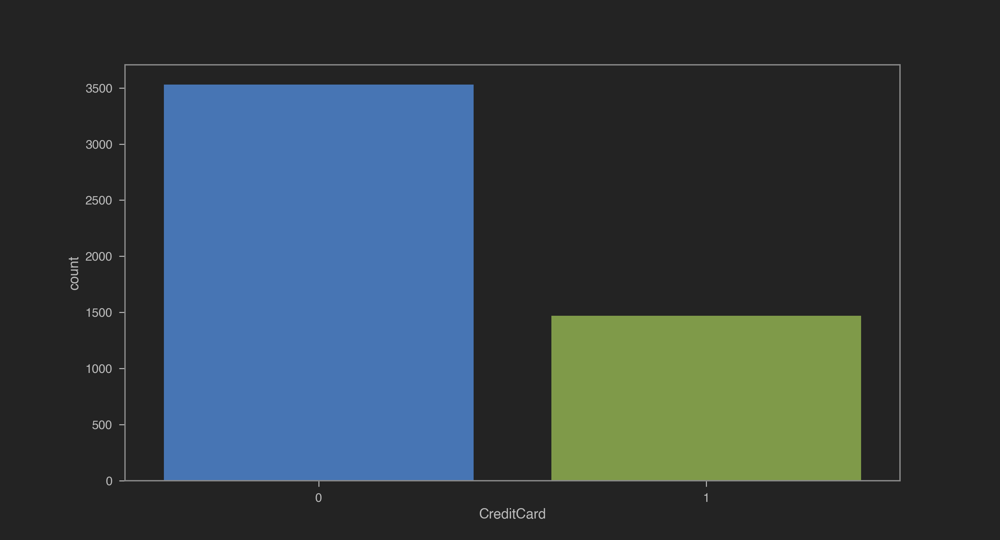
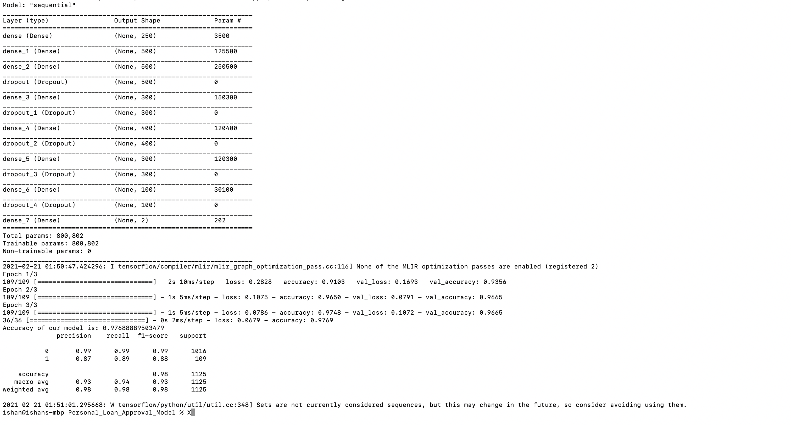

Me:Hi there,
i have trained machine learning model!
You:what it does?
Me:ah it predicts will client accept bank's personal loan offer using bank's customer record and previous personal loan acception kinda complicated right but trust me it is super useful
You: i have heard that there are several machine leaning model which one you use?
Me: i have used simple ANN model (Artificial neural network)
You: how it is different from other?
Me: it is kinda like every input is connected to other inputs 
You: why is that?
Me: it is like one neural would do simple calculation and produce result pass it to other it would be continue until last neural and we get our desired output
You: ok tell me in simple words
Me: your maths teacher give you sum to do and neurals in your brain calculate it and you give answer something like that
You: okay understood would you show me some interesting things about project??
 Me: Okay See

You see we have data of 5000 customers universal bank
You: thats alot!
Me: Thats not it trust me you would be surprised
let us visualise data so we can know what kinda things we have to deal with
You:okay!

Me:
You see this is graph of customer'age distribution.it means we have divided our customer in ages groups
You: seems like fair

Me:
so this graph divided in two groups 
1.income of customers who accepted loan
2.income of customers who rejected loan
you see customer who have accepted loan have higher income

You:Kinda obivious people who earn more usually take loans too

Me:
this graph of people who have credit card(1) and people who dont (0)
You:Oh so many people dont have it kinda suprising nowadays

Me:
customers grouped by their education

You: Ah, seems diverse

Me:
see here i grouped customers by their income
You: why is it sloping downwards?
Me:ofc it would because as income increase number of customers who have that income decrease
You:Ohh

Me:
this is heatmap of all informations we have
You: what does heatmap mean?
Me: it sort of relation between two inputs
 
You: what this numbers are about?
 
Me: if two inputs are closely related then that number would be greater zero and less than one 
number depends on how closely related they are and if they are not then number would be negative
You: i don't undestand
Me:hmm like you said earlier usually people with more income take loan right see there is postive relation between them so you were right.one more example see age and experience they also have postive relation like aged customer have more experience and there is no relation between age and income so negative do u understand?? 
You: Yea i understood you are great teacher
Me: Thanks haha
Me:
This graph of our customers credit card avg spending like grouped by their debt
You:woah,people seems like use credit card alot 
Me: now we would train our model and see it accuracyyou: i am so excited!!!
Me:

you see we have trained our model and it has accuracy of 97%
You: woah thats so cool so it means if we test it 100 times it would answer correct 97 times
Me:Do you like it? 
You:Yes,Yes i love it
Me: would you learn more about machine leaning 
You:For sure!! thanks

